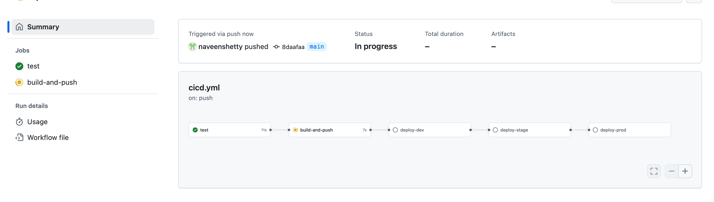
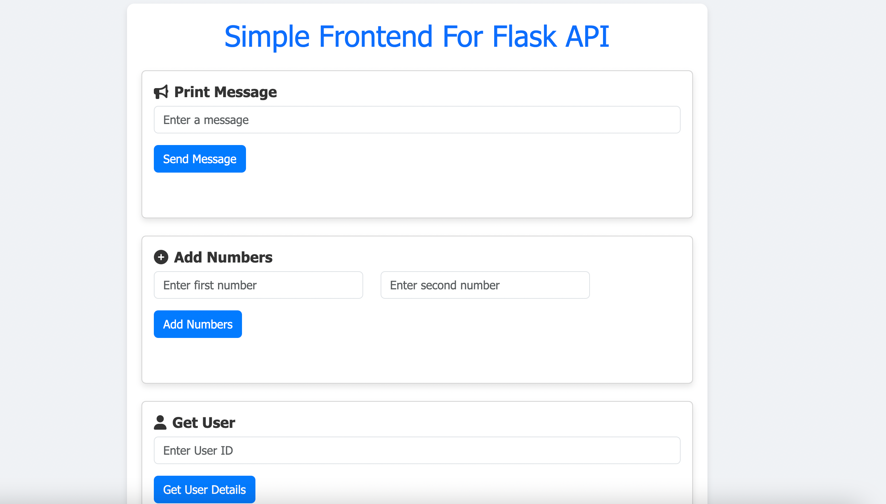

## Overview

This project implements a CI/CD pipeline to ensure high-quality software delivery and a consistent deployment process. The pipeline is responsible for:

- Running tests (using `pytest` for the Flask backend, frontend I did not see any test).
- Building Docker images for both backend and frontend services.
- Pushing Docker images to Docker Hub.
- Deploying the latest images to dev e.g EC2 instance.(stage and prod, sample blcok added in github action file)
- Managing cloud infrastructure via Terraform with gitlab CICD(hosted on [GitLab](https://gitlab.com/naveenshetty0812/aize-infra-solution)).

The solution follows a “build once, deploy anywhere” approach and includes environment-specific deployment steps.

- **backend-service/**: Contains the Flask application along with its Dockerfile and tests.
- **frontend-service/**: Contains the Node.js application and its Dockerfile.
- **docker-compose.yml**: A Docker Compose file to build both services locally.
- **.github/workflows/cicd.yml**: GitHub Actions workflow file defining the CI/CD pipeline.

### Workflow Stages

1. **Test Stage:**
   - Checks out the code.
   - Sets up Python (version 3.9) and installs dependencies (Flask, pytest, flask_cors etc).
   - Runs tests in the `backend-service/src/test` directory.

2. **Build and Push Stage:**
   - Checks out the code and sets up Docker Buildx.
   - Installs Docker and Docker Compose.
   - Logs into Docker Hub using secrets.
   - Builds Docker images for both services using Docker Compose.
   - Tags and pushes images to Docker Hub (both `latest` and a commit-specific tag using `${{ github.sha }}`).

3. **Deployment Stages:**
   - **Deploy to Development:** Uses SSH actions to deploy the backend and frontend containers to a development server (EC2).Example as one aws ec2 instance
   - **Deploy to Staging:** Echoes a message indicating a deployment to the staging environment.
   - **Deploy to Production:** Echoes a message indicating a deployment to the production environment.
   
- **Some picture:** 
- 
- 

### Keeping security in mind , required fields are variablized in github setting

### When I keep scalabilty and availablity in mind , better solution is deploying services into cloud provider kubernetes service, example EKS.

# EKS deployments with CI/CD Pipeline, just an idea drwan

### **Source Code & CI/CD**
- **GitHub / GitLab Repo:** Hosts our application code.
- **CI/CD Pipeline:** Uses GitHub Actions or GitLab CI to run tests, build Docker images, and push them to a registry may be ECR.

### **Container Build & Registry**
- **Docker Build & Push:** Images are built and pushed to a container registry (for example, AWS ECR).

### **Infrastructure Provisioning**
- **Terraform:** Automates provisioning of the AWS infrastructure, sample and not all [created](https://gitlab.com/naveenshetty0812/aws_eks_infra)(including VPC, EKS Cluster, Node Groups with Auto Scaling, and ALB).

### **EKS Cluster**
- **Managed Kubernetes:** Managed Kubernetes environment where containerized workloads run.
- **Node Groups & Auto Scaling:** This ensures that the underlying EC2 instances can scale based on load.

### **Ingress & Application Deployment**
- **ALB Ingress Controller:** Routes external traffic into the cluster.
- **Helm Charts:** Manages deployments of the backend (Flask) and frontend (Node.js) services into the EKS cluster.

### **Application Services**
- **Backend & Frontend Services:** Containerized applications deployed via Helm.

### **Monitoring & Logging**
- **Grafana, Prometheus, and AWS CloudWatch:** we can use for monitoring application health, performance, and logs.

---

